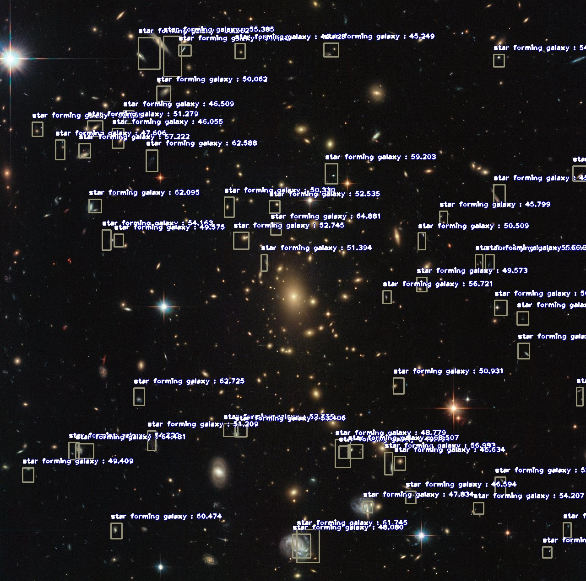

# Star-Forming-Galaxy-One-Shot-ImageAI
One shot object detection using [ImageAI](https://github.com/OlafenwaMoses/ImageAI)

# How to Train

Run `training.ipynb`, download the Yolo pretrained weight here:
https://github.com/OlafenwaMoses/ImageAI/releases/tag/essential-v4

# How to test

Run the `inference.ipynb`, use the models at galaxies/models. Use a sample image to be evaluated. 

This is the example

